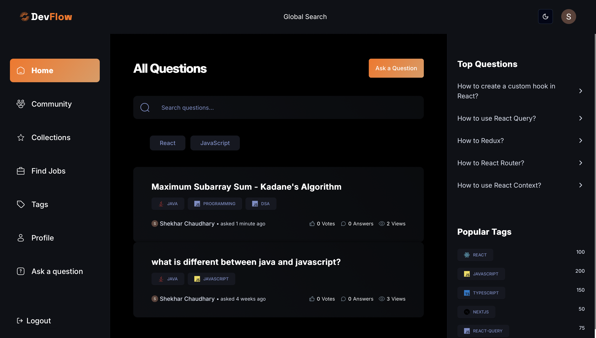
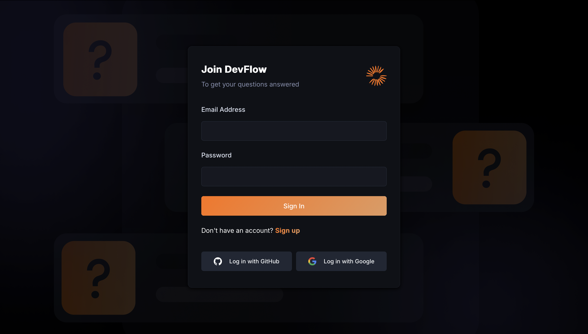
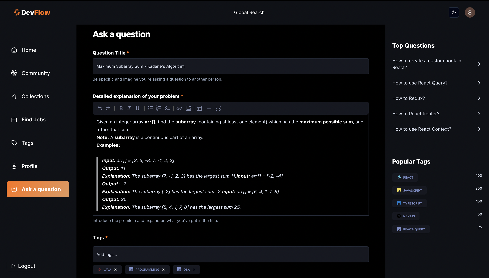
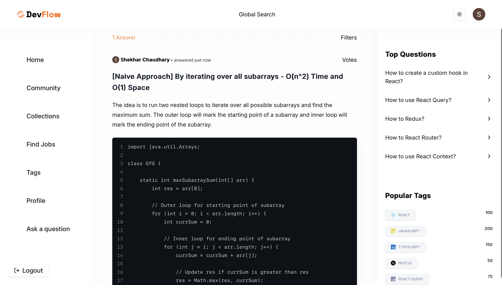

# DevFlow

> Not your typical Amazon or YouTube clone that every dev and their mother has in their portfolio. Nope.

DevFlow is a **modern StackOverflow-style Q&A platform** built for developers, featuring:  
- 📌 A **recommendation system** for posts (personalized content discovery)  
- 🌍 **Global database data-fetching** for instant scalability  
- 🤖 **AI-generated answers** to questions  
- ⚡ Built with cutting-edge full-stack tools to deliver performance and developer experience  

---

## 🛠️ Tech Stack
- **Frontend & Framework**: Next.js 15  
- **Styling**: Tailwind CSS  
- **Backend**: Node.js  
- **Database**: MongoDB  
- **Validation**: Zod  

---

## ✨ Key Features
- 🔐 **Authentication & Authorization**: Social logins + Email/Password  
- 📝 **Ask & Answer Questions**: AI-powered answer suggestions  
- 👍 **Voting & Reputation System**: Upvote/Downvote, gamified reputation  
- 🏷️ **Tags & Collections**: Organize posts and collections  
- 🌍 **Community Pages**: Explore trending and recommended content  
- 🔎 **Search & Filtering**: Full-text search, filter by popularity or relevance  
- 👤 **User Profiles**: Stats, badges, and contributions  
- 🌙 **Dark / Light Mode**: Seamless theme switching  
- 📊 **Optimized Performance**: Server Actions + API Routes, caching, global DB fetching  
- 🚀 **Deployment Ready**: Optimized build for production  

---

## 📸 Screenshots

  





*(Add more screenshots as needed in `app/Sshots/` folder)*

---

## ⚡ Setup & Installation

```bash
# Clone the repo
git clone https://github.com/shekhar566/DevFlow.git

# Go to project folder
cd DevFlow

# Install dependencies
npm install

# Run the development server
npm run dev
