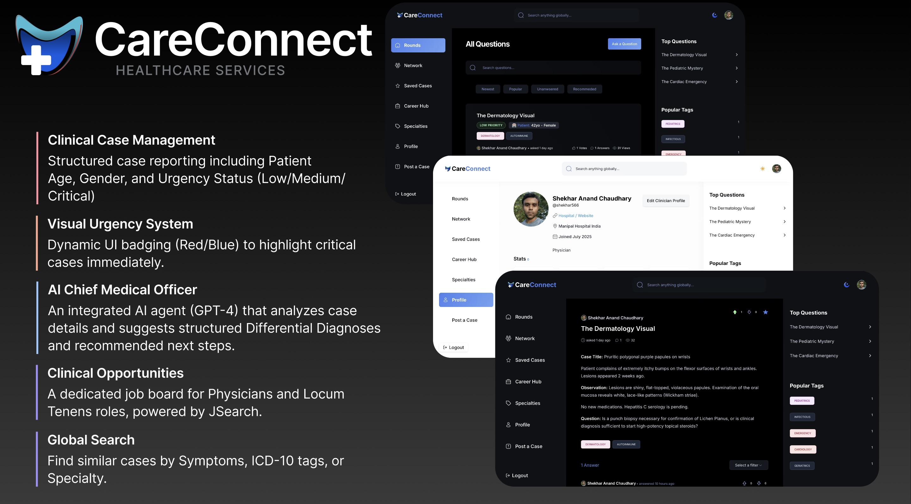

<div align="center">
  <br />
    <a href="https://care-connect-shekhar.vercel.app" target="_blank">
      
    </a>
  <br />

  <h1 align="center">
     
    CareConnect
    
  </h1>
 
  

  <p align="center">
    <strong>A Secure Clinical Consultation & Case Collaboration Platform</strong>
  </p>

  <p align="center">
    <a href="https://care-connect-shekhar.vercel.app">View Live Demo</a>
    ·
    <a href="https://github.com/shekhar566/care-connect/issues">Report Bug</a>
    ·
    <a href="https://github.com/shekhar566/care-connect/pulls">Request Feature</a>
  </p>
</div>

<div align="center"> 
  
  
  
  
  
  
</div>

<br />

> **Note:** CareConnect is a pivot from a standard Q&A forum to a specialized medical tool. It introduces domain-specific schemas like **Urgency Levels**, **Patient Demographics**, and **Differential Diagnosis AI**.

---

## 🚀 About The Project

**CareConnect** is designed to bridge the gap between clinical uncertainty and expert consensus. Unlike generic forums, this platform allows medical professionals to share anonymized patient cases, request second opinions, and receive instant AI-assisted differential diagnoses.

### 🌟 Key Features

- **🩺 Clinical Case Management**: Structured case reporting including **Patient Age**, **Gender**, and **Urgency Status** (Low/Medium/Critical).
- **🤖 AI Chief Medical Officer**: An integrated AI agent (GPT-4) that analyzes case details and suggests structured **Differential Diagnoses** and recommended next steps.
- **🚨 Visual Urgency System**: Dynamic UI badging (Red/Blue) to highlight critical cases immediately.
- **💼 Clinical Opportunities**: A dedicated job board for Physicians and Locum Tenens roles, powered by JSearch.
- **🔐 Secure Authentication**: Role-based access via Clerk to ensure community integrity.
- **🌍 Global Search**: Find similar cases by Symptoms, ICD-10 tags, or Specialty.
- **💎 Reputation System**: Gamified "Clinical Credibility" scores based on accepted opinions and community upvotes.

---

## 🛠️ Tech Stack

| Category | Technology |
| --- | --- |
| **Framework** | Next.js 15 (App Router) |
| **Styling** | TailwindCSS (Medical Blue Theme) + ShadCN UI |
| **Database** | MongoDB + Mongoose |
| **Authentication** | Clerk (Social + Email) |
| **AI Integration** | OpenAI API (GPT-3.5/4) |
| **External APIs** | JSearch (RapidAPI) |

---

## ⚡ Getting Started

### Prerequisites

Ensure you have the following installed:
- Node.js (v18+)
- npm

### Installation

1. **Clone the repository**
   ```bash
   git clone [https://github.com/shekhar566/care-connect.git](https://github.com/shekhar566/care-connect.git)
   cd care-connect
